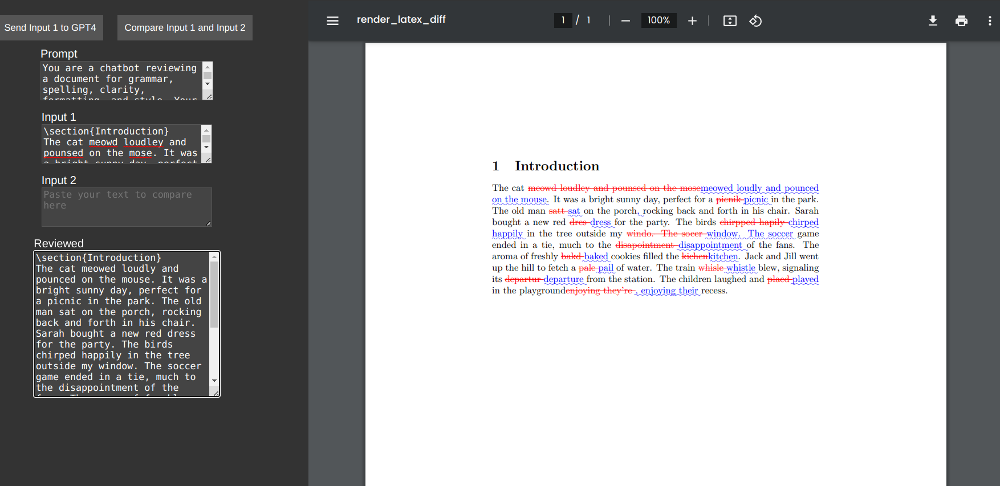

# LaTeX Reviewer Flask App



This Flask app allows you to review and compare LaTeX documents using the GPT-4 API. You can either compare two LaTeX documents directly or use the GPT-4 API to review and suggest edits to your document.

## Installation Instructions

1. Clone the repository:

```
git clone https://github.com/muc-martin/gptEditor.git
cd gptEditor
```

2. Create a virtual environment and install the required packages:

```
python3 -m venv venv
source venv/bin/activate
pip install -r requirements.txt
```

3. Install LaTeX and latexdiff on Ubuntu:

```
sudo apt-get install texlive-latex-base texlive-latex-extra latexdiff
```

4. Set the GPT-4 API key in your environment variables:

```
export OPENAI_API_KEY=your_api_key_here
```

Replace `your_api_key_here` with your actual GPT-4 API key.

5. Run the Flask app:

```
flask run
```

## Usage

The app provides two modes:

1. Compare mode (no API key required): Directly compare two LaTeX documents and generate a diff PDF.
2. Review mode: Send your LaTeX document to the GPT-4 API for review and suggested edits, then generate a diff PDF showing the changes.

You can also edit the prompt sent to the GPT-4 API by modifying the text in the prompt field.